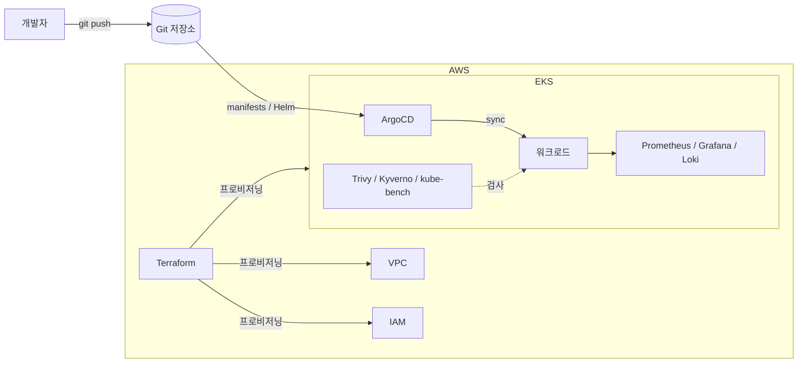

# eks-gitops-platform

**AWS EKS** 위에 GitOps 방식으로 Kubernetes 플랫폼을 직접 구축해보는 프로젝트입니다.
인프라는 전부 Terraform으로 프로비저닝하고, 배포는 **ArgoCD**로, 그리고 관측성(observability)과
DevSecOps 가드레일까지 하나씩 붙여 나갑니다.

## 목표

작은 팀이 실제로 운영할 법한 플랫폼을 세워보고, 각 레이어를 직접 만들면서 익힙니다.

- **Infrastructure as Code** — `terraform apply` 한 번으로 VPC, EKS, IAM이 올라옵니다.
- **GitOps 배포** — 클러스터의 원하는 상태(desired state)를 Git에 두고, ArgoCD가 맞춰줍니다.
- **Observability** — 메트릭(Prometheus/Grafana)과 로그(Loki)를 기본 제공합니다.
- **DevSecOps** — 이미지 스캔, 정책 강제, CIS 벤치마크를 파이프라인에 포함합니다.

## 아키텍처 (목표)



상세 설계와 그 결정 이유는 [docs/architecture.md](docs/architecture.md)에 정리했습니다.

## 저장소 구조

```
.
├── terraform/          # IaC — VPC, EKS, IAM (환경별)
│   ├── environments/   # dev / (staging) / (prod) 루트 모듈
│   └── modules/        # 재사용 가능한 vpc / eks 모듈
├── gitops/             # ArgoCD app-of-apps — 클러스터 desired state
│   ├── bootstrap/      # ArgoCD 설치(pinned) + 전체를 관리하는 root Application
│   └── apps/           # 워크로드별 Application (sample-app 등)
├── observability/      # Prometheus, Grafana, Loki 설정
├── security/           # DevSecOps: Kyverno 정책, kube-bench, External Secrets
├── docs/               # 아키텍처 · 로드맵
│   ├── verification/   #   └ 단계별 라이브 검증 기록
│   └── troubleshooting/#   └ 검증 중 만난 문제와 해결 과정
└── .github/workflows/  # CI: terraform fmt/validate + Trivy 스캔
```

## 로드맵

| 단계 | 내용 | 상태 |
|------|------|------|
| 1 | Terraform 기반 구성 — VPC, EKS, remote state | ✅ 검증 완료 (라이브 EKS apply) |
| 2 | GitOps — ArgoCD bootstrap + 샘플 앱 | ✅ 검증 완료 (8/8 앱 Synced/Healthy) |
| 3 | Observability — Prometheus, Grafana, Loki | ✅ 코드 완료 (검증 전) |
| 4 | DevSecOps — Trivy, Kyverno, kube-bench, External Secrets | ✅ 코드 완료 (검증 전) |

전체 내용은 [docs/roadmap.md](docs/roadmap.md)에 있습니다.

## 시작하기 (작성 중)

> 아래는 의도한 워크플로우입니다. 각 단계가 구현되면서 채워집니다.

```bash
# 0. remote state 백엔드 1회 생성 (S3 + DynamoDB)
cd terraform/bootstrap
terraform init && terraform apply

# 1. 기반 인프라 프로비저닝 (Phase 1)
cd ../environments/dev
cp backend.hcl.example backend.hcl        # bootstrap output으로 채우기
terraform init -backend-config=backend.hcl
terraform plan

# 2. GitOps 부트스트랩 (Phase 2)
kubectl apply -k gitops/bootstrap/argocd        # ArgoCD 설치 (1회)
kubectl apply -f gitops/bootstrap/root-app.yaml # app-of-apps root
```

> 💸 **비용 주의:** EKS 컨트롤 플레인과 노드는 공짜가 아닙니다. 이 프로젝트는 배우려고
> `terraform apply` 했다가, 같은 날 `terraform destroy` 하는 걸 전제로 합니다.

## 기술 스택

Terraform · AWS EKS · ArgoCD · Helm · Prometheus · Grafana · Loki · Trivy · Kyverno · GitHub Actions

## 라이선스

[MIT](LICENSE)
