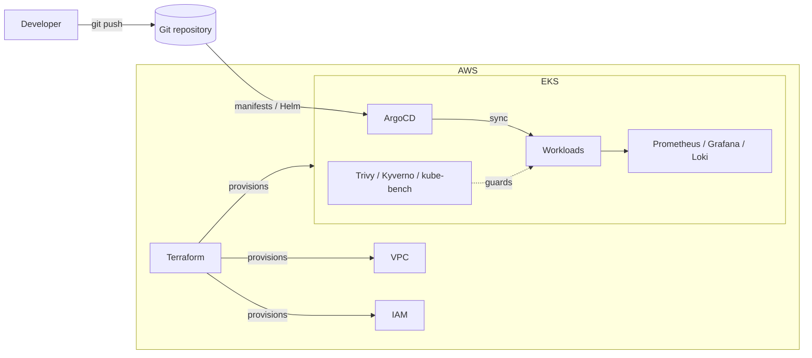

# eks-gitops-platform

A hands-on project to build a GitOps-driven Kubernetes platform on **AWS EKS** —
provisioned entirely with Terraform, delivered with **ArgoCD**, and wired up with
observability and DevSecOps guardrails.

> **Status: 🚧 Work in progress — building in the open.**
> This repository is a learning-first infrastructure project. The layout below is
> the *target* architecture; each piece is being implemented phase by phase (see
> [docs/roadmap.md](docs/roadmap.md)). Nothing here claims to be finished — the
> point is to show the design and the build process honestly.

---

## Goal

Stand up the kind of platform a small team would run in production, and learn every
layer by doing it myself:

- **Infrastructure as Code** — one `terraform apply` brings up VPC, EKS, and IAM.
- **GitOps delivery** — the cluster's desired state lives in Git; ArgoCD reconciles it.
- **Observability** — metrics (Prometheus/Grafana) and logs (Loki) out of the box.
- **DevSecOps** — image scanning, policy enforcement, and CIS benchmarking in the pipeline.

## Architecture (target)



See [docs/architecture.md](docs/architecture.md) for the detailed design and the
decisions behind it.

## Repository layout

```
.
├── terraform/          # IaC — VPC, EKS, IAM (per-environment)
│   ├── environments/   # dev / (staging) / (prod) root modules
│   └── modules/        # reusable vpc / eks modules
├── gitops/             # ArgoCD app-of-apps — cluster desired state
│   ├── bootstrap/      # root Application that owns everything else
│   └── apps/           # per-workload Applications
├── observability/      # Prometheus, Grafana, Loki configuration
├── security/           # DevSecOps: scanning, policies, benchmarks
├── docs/               # architecture & roadmap
└── .github/workflows/  # CI: terraform fmt / validate / plan
```

## Roadmap

| Phase | Focus | Status |
|-------|-------|--------|
| 1 | Terraform foundation — VPC, EKS, remote state | 🚧 In progress |
| 2 | GitOps — ArgoCD bootstrap + sample app | ⬜ Planned |
| 3 | Observability — Prometheus, Grafana, Loki | ⬜ Planned |
| 4 | DevSecOps — Trivy, Kyverno, kube-bench | ⬜ Planned |

Full breakdown in [docs/roadmap.md](docs/roadmap.md).

## Getting started (WIP)

> These commands describe the intended workflow. They will fill in as the phases land.

```bash
# 1. Provision the foundation (Phase 1)
cd terraform/environments/dev
terraform init
terraform plan

# 2. Bootstrap GitOps (Phase 2)
kubectl apply -f gitops/bootstrap/root-app.yaml
```

> 💸 **Cost note:** an EKS control plane and its nodes are not free. This project is
> meant to be `terraform apply`-ed to learn, then `terraform destroy`-ed the same day.

## Tech stack

Terraform · AWS EKS · ArgoCD · Helm · Prometheus · Grafana · Loki · Trivy · Kyverno · GitHub Actions

## License

[MIT](LICENSE)
