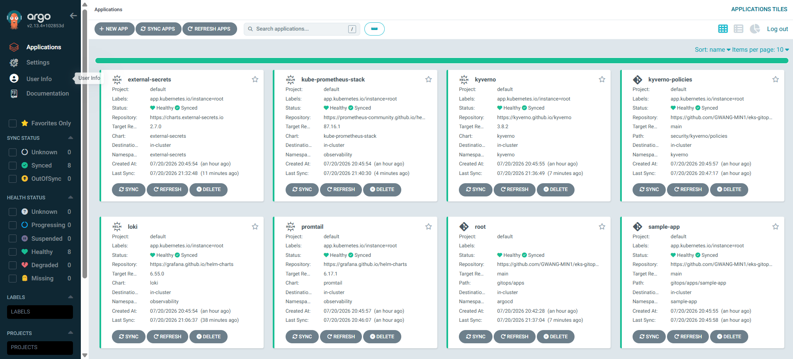
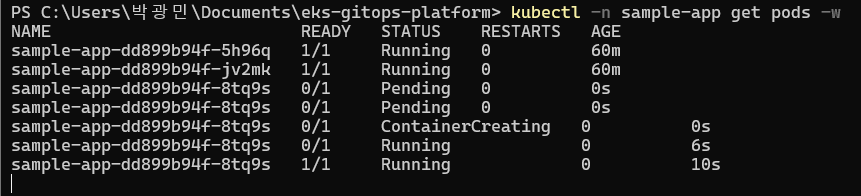

# Phase 2 검증 기록 — ArgoCD 기반 GitOps

- **일시**: 2026-07-20 (Phase 1 검증 직후, 같은 클러스터에서 연속 진행)
- **결과**: ✅ 전 항목 통과 — 최종 **8/8 Application Synced/Healthy**



## 검증 흐름

수동 조작은 딱 두 번뿐 — 이후 모든 배포는 Git이 담당한다:

```bash
kubectl apply -k gitops/bootstrap/argocd            # 1. ArgoCD 설치 (v2.13.4 고정)
kubectl apply -f gitops/bootstrap/root-app.yaml     # 2. app-of-apps root
```

root Application이 `gitops/apps/`를 읽어 자식 앱 7개를 **자동 생성** — sample-app,
kube-prometheus-stack, loki, promtail, kyverno, kyverno-policies, external-secrets.
Phase 3·4 스택까지 GitOps만으로 배포됨.

## 항목별 결과

| 로드맵 항목 | 확인 방법 | 결과 |
|------------|-----------|------|
| ArgoCD 설치 | `rollout status deploy/argocd-server` + UI 로그인 | 파드 7개 Running, UI 접속 ✅ |
| app-of-apps root | `kubectl -n argocd get applications` | root Synced + 자식 7개 자동 생성 ✅ |
| GitOps로 샘플 배포 | `kubectl -n sample-app get pods` + port-forward | 파드 2개 Running, nginx 응답 ✅ |
| push→sync 흐름 | 아래 2건의 실증 | ✅ |

## push→sync 실증 2건

**1) 계획된 데모 — replicas 스케일링.** `deployment.yaml`의 `replicas: 2 → 3` 수정 후
`git push`만 실행. 약 3분 내 세 번째 파드가 자동 생성됨 (`kubectl` 조작 0회).
되돌리는 커밋을 push하자 파드가 3→2로 자동 축소 — 왕복 모두 확인.



**2) 실전 — Loki CrashLoop 복구.** 검증 중 발견한 Loki 기동 실패
([트러블슈팅 #2](../troubleshooting/02-loki-read-only-filesystem.md))를
values.yaml 수정 → `git push` 만으로 해결. ArgoCD가 변경을 감지해 자동
재배포했고 `loki-0`이 2/2 Running으로 복구됨. 계획된 데모보다 강력한
실전 증명이었다.

## 검증 중 발생한 이슈

세 건 모두 실제 클러스터에서 진단하고 **Git 수정만으로** 해결했다.
상세: [`../troubleshooting/`](../troubleshooting/)

1. [t3.medium max-pods=17 한계로 hook job Pending](../troubleshooting/01-max-pods-t3-medium.md)
2. [Loki read-only 루트 파일시스템 CrashLoop](../troubleshooting/02-loki-read-only-filesystem.md)
3. [CRD 영구 OutOfSync — k8s 1.30의 selectableFields drop](../troubleshooting/03-crd-permanent-outofsync.md)

## 메모

- root-app을 ArgoCD 설치 직후 바로 apply하면 repo-server가 아직 안 떠서 첫 비교가
  `Unknown`(connection refused)으로 남을 수 있음 — 1~2분 내 자동 회복되며,
  `argocd.argoproj.io/refresh` 어노테이션으로 즉시 재시도 가능.
- kube-prometheus-stack이 가장 오래 걸림(CRD 다수) — `OutOfSync/Missing` 상태로
  수 분 보이는 것은 정상적인 설치 진행 과정.
