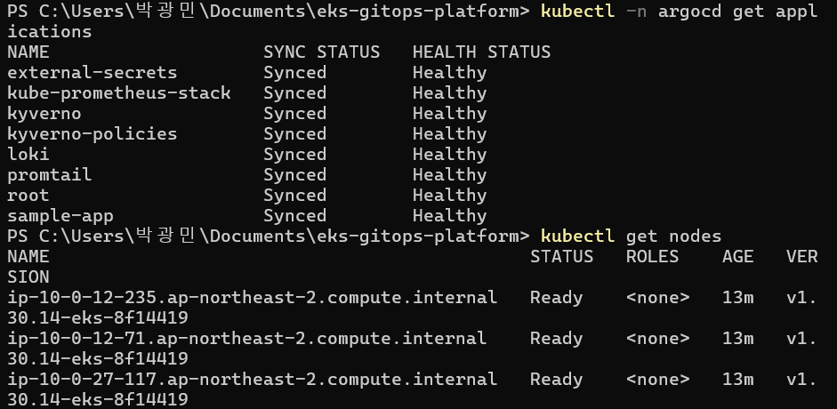
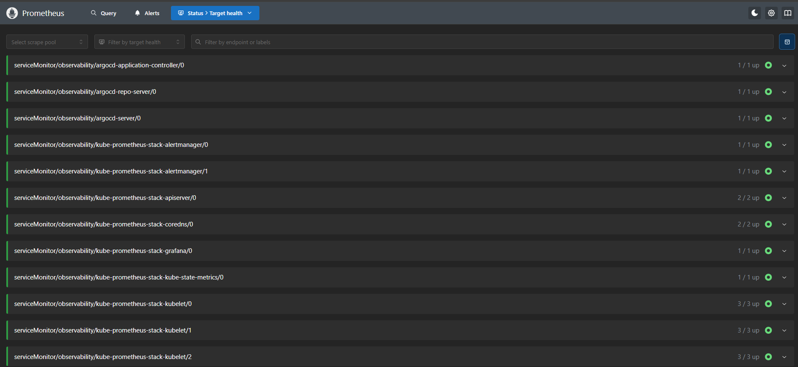
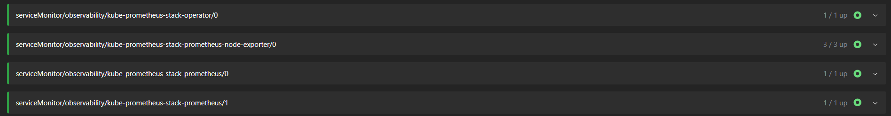
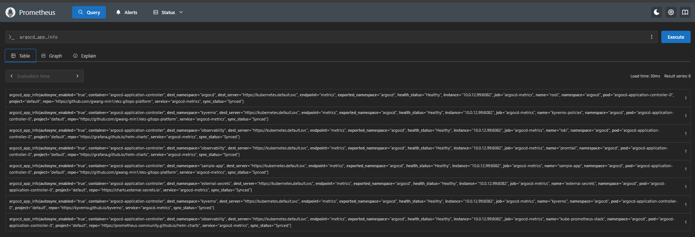
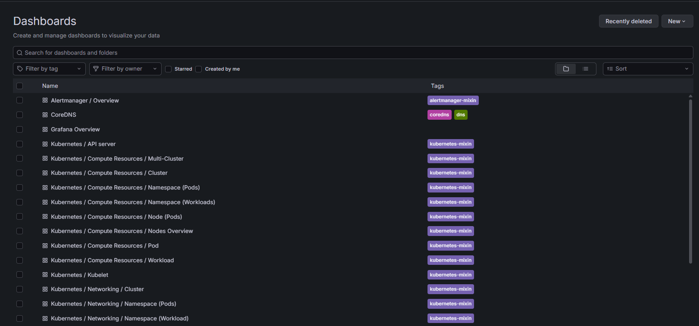
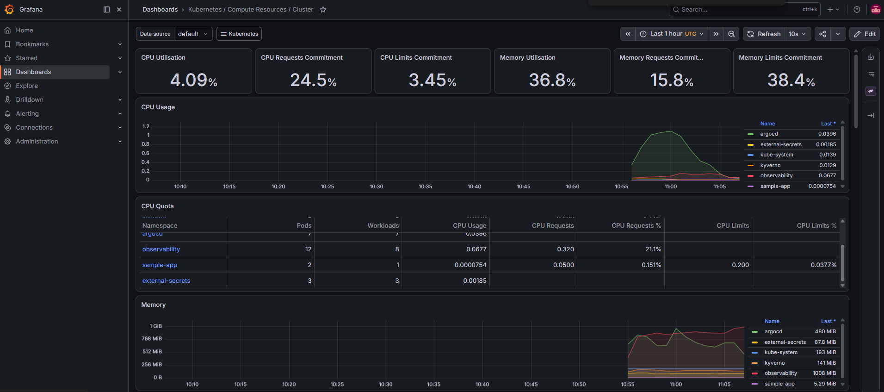
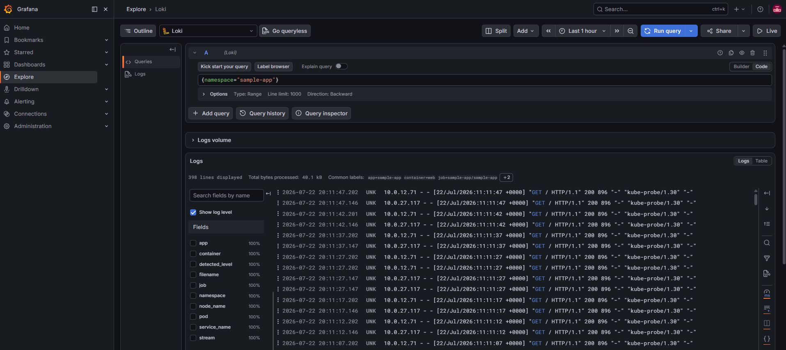
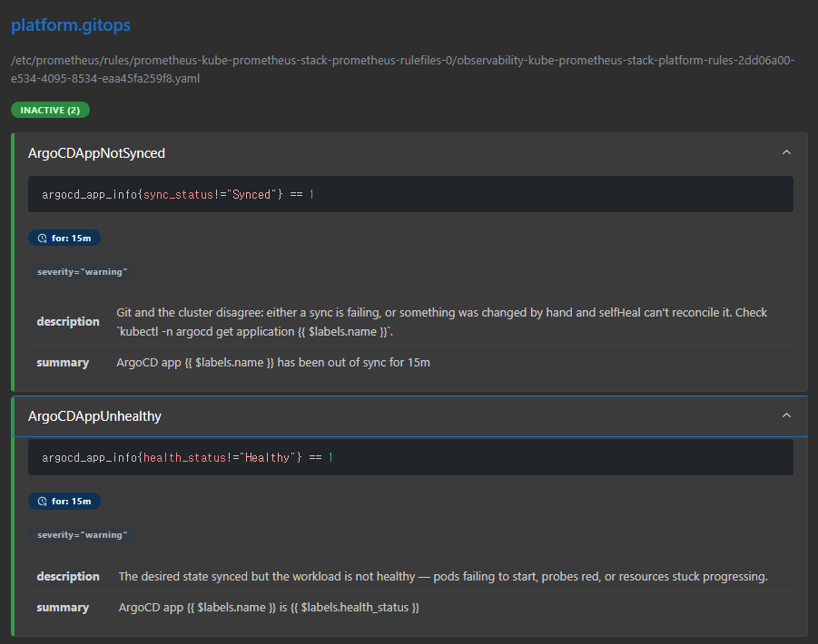
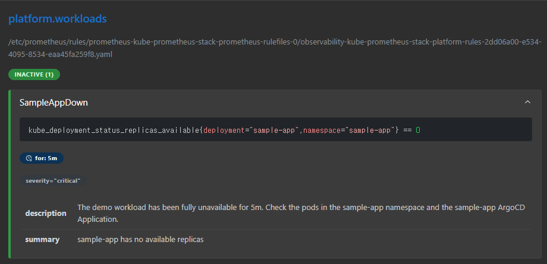

# Phase 3 검증 기록 — Observability

- **일시**: 2026-07-22
- **환경**: 실계정 (ap-northeast-2), EKS 1.30, 노드 3대(t3.medium SPOT)
- **결과**: ✅ 전 항목 통과 (메트릭 · 대시보드 · 로그 · 알림)

클러스터를 처음부터 `node_desired_size=3`으로 재생성 → Phase 2 부트스트랩 →
8/8 Application Synced/Healthy. 지난 세션에 고친 이슈(Loki `/var/loki`,
CRD OutOfSync)가 이미 반영돼 있어 이번엔 그 문제 없이 한 번에 떴다.

## Part 1 — Prometheus (메트릭 수집)

`kubectl -n observability port-forward svc/kube-prometheus-stack-prometheus 9090:9090`

**타겟 상태** — Status → Target health: 표준 타겟(apiserver, coredns, kubelet,
node-exporter, kube-state-metrics)과 **직접 추가한 ArgoCD ServiceMonitor 3종**
(application-controller / repo-server / server)이 전부 `up`.

> **의도적으로 없는 것**: `kube-controller-manager`, `kube-scheduler`, `etcd`,
> `kube-proxy` 타겟은 목록에 아예 없다. EKS는 컨트롤플레인이 AWS 관리라
> 스크레이프가 불가능해서 values에서 꺼둔 것 — "누락"이 아니라 설계다.

**쿼리** — `argocd_app_info` → `Result series: 8`. GitOps 컨트롤러 자체를
모니터링하고 있으며, 각 시리즈의 `sync_status="Synced"` / `health_status="Healthy"`
라벨로 앱 상태를 메트릭만으로 파악할 수 있다. (이 메트릭이 Part 4의 ArgoCD 알림
규칙으로 이어진다.)

## Part 2 — Grafana (대시보드)

`kubectl -n observability port-forward svc/kube-prometheus-stack-grafana 3000:80`
· admin 비밀번호는 `kube-prometheus-stack-grafana` 시크릿에서 조회.

대시보드를 하나도 직접 만들지 않았지만 kubernetes-mixin / coredns /
alertmanager-mixin 대시보드 수십 개가 차트로 자동 배포됨.

**Kubernetes / Compute Resources / Cluster** — 그래프에 실데이터가 그려짐
(Prometheus → Grafana 파이프라인 확인). 네임스페이스별 사용량이 그대로 보이며
`observability`가 메모리 ~1GB로 최대 소비 — "이 스택이 클러스터 부하를 배로
늘린다"던 설계 예측과 일치.

## Part 3 — Loki (로그 조회) — 하이라이트

Grafana → Explore → 데이터소스를 **Loki**로 전환 → `{namespace="sample-app"}`.

`398 lines displayed`, `Common labels: app=sample-app, container=web, ...` —
promtail이 붙인 Kubernetes 라벨로 필터링됨. 로그 내용은 nginx가 probe에 응답한
`GET / HTTP/1.1 200 ... "kube-probe/1.30"`. **promtail(수집) → Loki(저장) →
Grafana(조회)** 파이프라인이 완결됐고, 메트릭과 로그를 같은 Grafana에서 본다.

## Part 4 — 알림 규칙

`alerts.yaml`에 정의한 커스텀 알림 3개가 `platform.gitops` / `platform.workloads`
그룹으로 로드됨 (차트 기본 알림 수십 개와 함께). 현재 전부 `INACTIVE`(평상시).

- `ArgoCDAppNotSynced` — `argocd_app_info{sync_status!="Synced"} == 1`, `for: 15m`
- `ArgoCDAppUnhealthy` — `argocd_app_info{health_status!="Healthy"} == 1`, `for: 15m`
- `SampleAppDown` — `kube_deployment_status_replicas_available{...} == 0`, `for: 5m`

> ArgoCD 알림 2개는 Part 1의 `argocd_app_info` 메트릭을 그대로 사용한다 —
> ServiceMonitor 수집(Part 1) → 알림 규칙(Part 4)이 하나로 연결된다.
> 알림을 실제로 Firing시키는 검증(sample-app을 0으로 스케일)은 다음 세션 과제.

## 항목별 결과 요약

| 로드맵 항목 | 확인 | 결과 |
|------------|------|------|
| kube-prometheus-stack | 타겟 up + argocd_app_info 8 series | ✅ |
| 대시보드 | mixin 대시보드 자동배포 + 실데이터 | ✅ |
| Loki 로그 | `{namespace="sample-app"}` 398줄 조회 | ✅ |
| 의미 있는 알림 | 커스텀 3종 로드(INACTIVE) 확인 | ✅ |

## 검증 중 얻은 팁 (사소하지만 기록)

- Grafana Explore는 기본 데이터소스가 Prometheus라 로그가 "No data"로 보인다 —
  좌상단에서 **Loki로 전환**해야 로그가 나온다.
- 커스텀 알림은 차트 기본 알림 수십 개 사이에 섞여 있다. 그룹 이름을
  `platform.*`으로 지어둬서 Alerts 탭에서 바로 식별된다.
- 클러스터 재생성 시 **처음부터 `-var="node_desired_size=3"`**으로 만들면
  지난번의 max-pods 만석 문제를 아예 피한다 (생성 시점엔 변수가 먹힌다).
