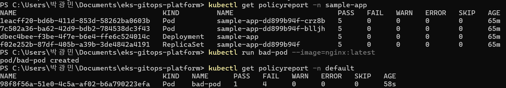
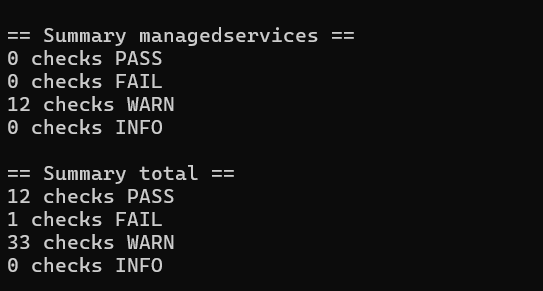
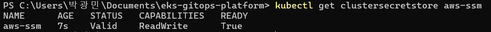
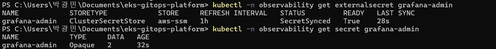
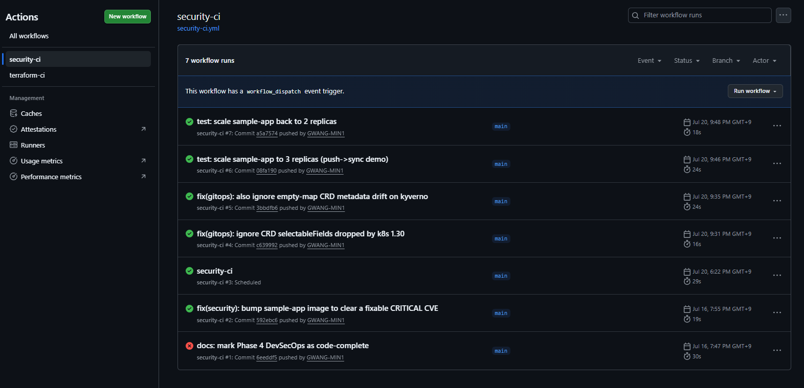

# Phase 4 검증 기록 — DevSecOps

- **일시**: 2026-07-23
- **환경**: 실계정 (ap-northeast-2), EKS 1.30, 노드 3대(t3.medium SPOT)
- **결과**: ✅ 전 항목 통과 (Kyverno 정책 · kube-bench · External Secrets+IRSA · Trivy CI)

클러스터 재생성 → 8/8 Synced/Healthy 후 진행. 시작하자마자 `kubectl no such host`를
만났는데, 매일 재생성 환경의 낡은 kubeconfig가 원인이었다 —
[트러블슈팅 #05](../troubleshooting/05-stale-kubeconfig-after-recreate.md).

## Part 1 — Kyverno 정책: 착한 앱 vs 나쁜 파드

ClusterPolicy 4개(disallow-latest-tag / require-resources / require-run-as-non-root /
restrict-privileges)가 Audit 모드로 로드된 상태에서, **정책이 실제로 위반을
구별하는지**를 대조 실험으로 확인했다:

| 대상 | 결과 |
|------|------|
| `sample-app` (정책을 통과하도록 설계) | **PASS 5 / FAIL 0** — Pod·Deployment·ReplicaSet 전부 |
| `kubectl run bad-pod --image=nginx:latest` (일부러 4개 정책 전부 위반) | **PASS 1 / FAIL 4** |



bad-pod는 `:latest` + 리소스 미지정 + root 실행 + 권한 미제한으로 만들었고,
**Audit 모드답게 생성은 허용되되 PolicyReport에 FAIL 4건이 즉시 기록**됐다.
(Enforce로 올리면 이 파드는 admission에서 거부된다 — Audit→Enforce 래칫이
동작할 근거를 확보한 셈.) 확인 후 bad-pod는 삭제.

## Part 2 — kube-bench (CIS EKS Benchmark)

`security/kube-bench/job-eks.yaml`을 apply → Job 완료 → 로그로 리포트 확인 → 삭제.



- **Summary total: 12 PASS / 1 FAIL / 33 WARN**
- WARN이 많은 것은 EKS 특성: `managedservices` 섹션(12 WARN)은 컨트롤플레인이
  AWS 관리라 클러스터 안에서 확인/조치 불가한 manual 항목들이다. 실질적으로
  읽어야 할 것은 node/policies 섹션 — FAIL 1건은 후속 조치 후보로 기록.

## Part 3 — External Secrets + SSM (IRSA 체인 완성)

Phase 1의 OIDC provider부터 시크릿 동기화까지 전체 체인을 실측:

```
Terraform IRSA 역할 (SSM read, /eks-gitops/dev/* 스코프)
  → ESO ServiceAccount에 role-arn 어노테이션 + rollout restart
  → SSM에 SecureString 2개 생성 (admin-user / admin-password)
  → ClusterSecretStore(aws-ssm) 적용
  → ExternalSecret(grafana-admin) 적용
```

| 확인 | 결과 |
|------|------|
| `kubectl get clustersecretstore aws-ssm` | **STATUS `Valid` / READY `True`** — IRSA로 AWS 인증 성공 |
| `kubectl -n observability get externalsecret grafana-admin` | **`SecretSynced` / READY `True`** |
| `kubectl -n observability get secret grafana-admin` | **Opaque / DATA 2** — SSM 값이 K8s Secret으로 실체화 |




**시크릿은 AWS(SSM)에, Git에는 참조만** — 이 원칙이 실제로 동작함을 확인.
정적 AWS 키는 어디에도 없다 (파드가 ServiceAccount 토큰으로 역할을 assume).

주의점 하나: **어노테이션 후 `rollout restart`가 필수**다. IRSA 자격증명은
파드 시작 시 주입되므로, 재시작 없이는 기존 파드가 여전히 자격증명이 없다.

## Part 4 — Trivy CI (빨강→초록 이력)

security-ci 워크플로우 실행 이력 자체가 증거다:



- **#1 (빨강)**: Phase 4 첫 push에서 게이트가 당시 이미지(nginx-unprivileged
  1.27-alpine)의 **fixable CRITICAL CVE를 잡고 CI를 실패**시킴
- **#2 (초록)**: 이미지를 1.30.4-alpine으로 bump한 커밋(`592ebc6`)으로 통과
- 이후 push·**주간 스케줄 실행**까지 전부 초록 — 게이트가 "한 번 작동하고 끝"이
  아니라 계속 지키고 있다는 뜻

## 항목별 결과 요약

| 로드맵 항목 | 확인 | 결과 |
|------------|------|------|
| Trivy 이미지 스캔 (CI) | CVE 차단→수정→통과 이력 + 주간 스케줄 | ✅ |
| Kyverno admission 정책 | PASS/FAIL 대조 실험 (Audit) | ✅ |
| kube-bench CIS 벤치마크 | EKS 프로파일 리포트 수령 | ✅ |
| 시크릿 관리 (ESO/SSM) | IRSA 전체 체인 + SecretSynced | ✅ |

## 후속 과제 (다음 세션 후보)

- Kyverno **Audit → Enforce** 전환 (bad-pod가 admission에서 거부되는 것 확인)
- kube-bench **FAIL 1건** 원인 확인 및 조치 여부 판단
- Grafana를 `grafana-admin` Secret으로 실제 연결 (`admin.existingSecret`)
- Phase 3에서 미룬 **SampleAppDown 알림 Firing** 실증
